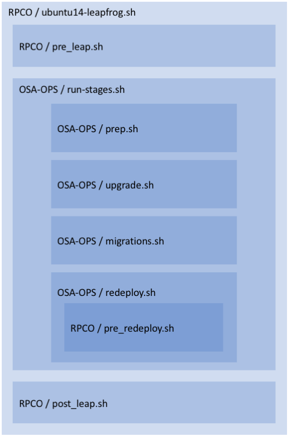

==================================
Rackspace Private Cloud - Upgrades
==================================

Overview
--------

A Leapfrog upgrade is a major upgrade that skips at least one release. Currently
rpc-upgrades repo supports:

Leapfrog upgrades from:

* kilo to r14.13.0 (newton)
* liberty to r14.13.0 (newton)

Major upgrades from:

* mitaka to r14.13.0 (newton)

The status of supported versions can be viewed from the periodic jobs located on the
`RPC Jenkins <https://rpc.jenkins.cit.rackspace.net/view/Upgrades>`_ server.

Terms
-----

* `RPCO <https://github.com/rcbops/rpc-openstack>`_: Rackspace Private Cloud powered by OpenStack
* `OSA <https://github.com/openstack/openstack-ansible>`_:  OpenStack Ansible
* `OSA-OPS <https://github.com/openstack/openstack-ansible-ops>`_:  OpenStack Operations
* `Kilo <https://github.com/rcbops/rpc-openstack/tree/kilo>`_: The RPCO release of OpenStack Kilo
* `Liberty <https://github.com/rcbops/rpc-openstack/tree/liberty>`_: The RPCO release of OpenStack Liberty
* `r14.13.0 <https://github.com/rcbops/rpc-openstack/tree/r14.13.0>`_: The RPCO release of OpenStack Newton.

Pre Leapfrog Tasks
------------------

* Verify that the deployment is healthy and at the latest version.
* Perform database housekeeping to prevent unnecessary migrations.

Executing a leapfrog upgrade
----------------------------

The first step is to checkout the rpc-upgrades repo. 

.. code-block:: shell

    git clone https://github.com/rcbops/rpc-upgrades.git /opt/rpc-upgrades

Two variables will need to be set in `/etc/openstack_deploy/user_variables.yml`
before proceeding with the upgrade

.. code-block:: yaml

    lxc_container_backing_store: "dir" # 'dir' is the tested value. Other options are "lvm" and "overlayfs"
    neutron_legacy_ha_tool_enabled: "yes"

These variables are required by later versions, but are not defined in Kilo or Liberty.

By default Elasticsearch data will be kept and Elasticsearch will be upgraded at the end of the leapfrog.
If you'd like to reset the Elasticsearch data, you can override the upgrade and remove the container during
the upgrade by setting these environment variables:

.. code-block:: shell

    export UPGRADE_ELASTICSEARCH="no"
    export CONTAINERS_TO_DESTROY='all_containers:!galera_all:!neutron_agent:!ceph_all:!rsyslog_all'

**Note:** *Currently the rpc-upgrades repo targets r14.13.0.  If you want to deploy the previous version you can:*

.. code-block:: shell

   export RPC_TARGET_CHECKOUT=r14.12.0

If you cannot locate `/etc/openstack-release` or it is outdated. Export the release version which upgrade from manually:

.. code-block:: shell

    export CODE_UPGRADE_FROM='KILO/LIBERTY'

The next step is to execute the leapfrog upgrade script and follow the prompts:

.. code-block:: shell

    cd /opt/rpc-upgrades
    scripts/ubuntu14-leapfrog.sh

Executing a major upgrade
----------------------------

The first step is to checkout the rpc-upgrades repo.

.. code-block:: shell

    git clone https://github.com/rcbops/rpc-upgrades.git /opt/rpc-upgrades

By default Elasticsearch data will be kept and Elasticsearch will be upgraded at the end of the leapfrog.
If you'd like to reset the Elasticsearch data, you can override the upgrade and remove the container during
the upgrade by setting these environment variables:

.. code-block:: shell

    export UPGRADE_ELASTICSEARCH="no"
    export CONTAINERS_TO_DESTROY='all_containers:!galera_all:!neutron_agent:!ceph_all:!rsyslog_all'

**Note:** *Currently the rpc-upgrades repo targets r14.11.0.  If you want to deploy the previous version you can:*

.. code-block:: shell

   export RPC_TARGET_CHECKOUT=r14.10.0

The next step is to execute the major upgrade script and follow the prompts:

.. code-block:: shell

    cd /opt/rpc-upgrades
    scripts/ubuntu14-mitaka-to-newton.sh

Structure of the leapfrog process
---------------------------------

The RPCO leapfrog scripts are a thin wrapper around OSA-OPS leapfrog tools. 

For details please refer to the scripts themselves. Paths are omitted for
brevity, scripts may not be in the root of the relevant repo.

Pre Leap
~~~~~~~~

This step removes modifications to RPCO Kilo that aren't compatible with RPCO
Newton. Currently this only contains an Ansible 1.9 compatibility workaround.

Prep
~~~~

This step executes pre-flight checks, and prompts the user for confirmation. It
also ensures that the databases are backed up. Backups are stored in
/openstack/backup on the physical host that houses the first galera container.

Upgrade
~~~~~~~

This step has a section for each major version between the source (Kilo) and
target (Newton) versions.

Each section includes:
  - Variable & Secrets Migration (OSA)
  - Fact Cleanup
  - Hostname Compatibility checks/modifications.
  - Inventory Upgrades

Migrations
~~~~~~~~~~

This step runs the database migrations for each major upgrade in sequence:
  - Kilo Deployments will run Liberty, Mitaka and Newton migrations
  - Liberty Deployments will run Mitaka and Newton Migrations

Re-Deploy
~~~~~~~~~

This step first runs the pre_redeploy script which handles RPC variable and
secret migrations. Next the target version of OSA is deployed.
During this stage, one of the original neutron agents containers is left running
to minimise downtime.

Post Leap
~~~~~~~~~

This step deploys the RPC additions on top of the already deployed OSA.

Rollback and Interruption
~~~~~~~~~~~~~~~~~~~~~~~~~

The Leapfrog upgrade is a one way process, once it has begun there is no
rollback. Once the services have been upgraded, they make changes to the
virtualisation and networking layers that would be difficult and disruptive
to reverse.

If a leapfrog upgrade is interrupted, it can be resumed. Each major step of the
leapfrog upgrade process creates a marker file, which will be used to skip
completed tasks on subsequent runs.

To resume, run ./ubuntu14-leapfrog.sh.

If a step fails information about that step will be printed along with all the
remaining steps. The operator must fix the failure before re-running the
leapfrog or completing the remaining steps manually.

Confirmation Prompts
~~~~~~~~~~~~~~~~~~~~

The leapfrog process does not run unattended, it requires the operator to
confirm at two points.

Near the start:
  - Confirm intention
  - Check source version

Before deploying the target version:
  - This gives the user the opportunity to check the integrity of
    migrated rpco variables and secrets before continuing.

F5 Modifications
~~~~~~~~~~~~~~~~

In cases where an F5 is used to facilitate load balancing several monitors,
virtual-servers and pools will need to be added or modified. While our F5
processing script will provide an actual diff on a per-environment basis, here
are the high-level changes that will need to be made.

ADD monitors:
  - Add the git repo pointed at the repo server on port 9418
  - Add the repo cache pointed at the repo server on port 3142
  - Add the novnc console pointed at the console containers on port 6080
  - Add an http monitor for the horizon containers on port 80

ADD pools:
  - Add a new pool for galera on port 3306
  - Add a new pool for the git repo on port 9418
  - Add a new pool for the repo cache on port 3142
  - Add a new pool for the novnc console on port 6080

MODIFY pools:
  - Update the horizon pool for port 443
  - Update the horizon pool to forward port 80 to 443

ADD virtual-servers:
  - Add a new virtual-server for galera on port 3307
  - Add a new virtual-server for novnc on port 6080
  - Add a new virtual-server for novnc with SSL on port 6080
  - Add a new virtual-server for the git repo on port 9418
  - Add a new virtual-server for the repo cache on port 3142

MODIFY virtual-servers:
  - Update the galera virtual-server for mirroring
  - Update the horizon virtual-server for an ssl cert

Problems
--------

Clone Failures
~~~~~~~~~~~~~~

The leapfrog process includes many git clones from github, if these requests are
rate limited, tasks can fail due to timeouts. As github is beyond our control,
the only solution is to wait for rate limits to reset before retrying.

Galera
~~~~~~

Occasionally the galera cluster may be in a non-functional state after the
leapfrog. If this is the case, follow the `Galera Maintenance section of the OSA
operations guide
<https://docs.openstack.org/openstack-ansible/newton/developer-docs/ops-galera-recovery.html>`_.

Confirmation Prompts and the Ctrl-c warning
~~~~~~~~~~~~~~~~~~~~~~~~~~~~~~~~~~~~~~~~~~~

The confirmation prompts instruct the user not to interrupt the leapfrog process
via ctrl-c. While an uninterrupted upgrade is the smoothest, the consequences
of interruption are not as dire as implied. The process can be resumed by
re-running the top level script, which will skip the steps that have already
been completed by checking for the existence of marker files.

Testing
-------

In the event you would like to simulate a leapfrog upgrade, follow the instructions
in the `testing document 
<https://github.com/rcbops/rpc-upgrades/blob/master/testing.rst>`_.  Using
vagrant, it will set up an AIO deployment of the desired version which can then
be leapfrog upgraded.  This allows you to test the scenario in the lab or
development environment before actually running the upgrade on a production
deployment.
